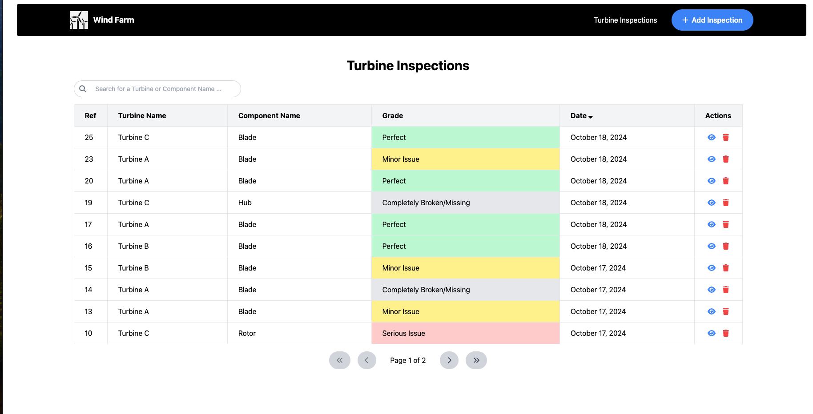
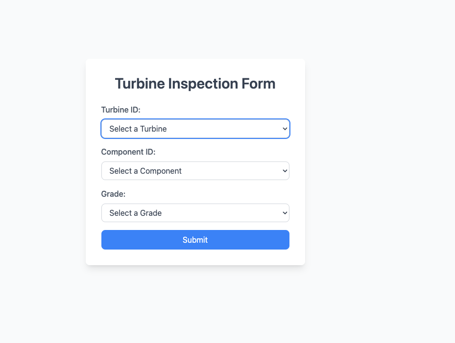
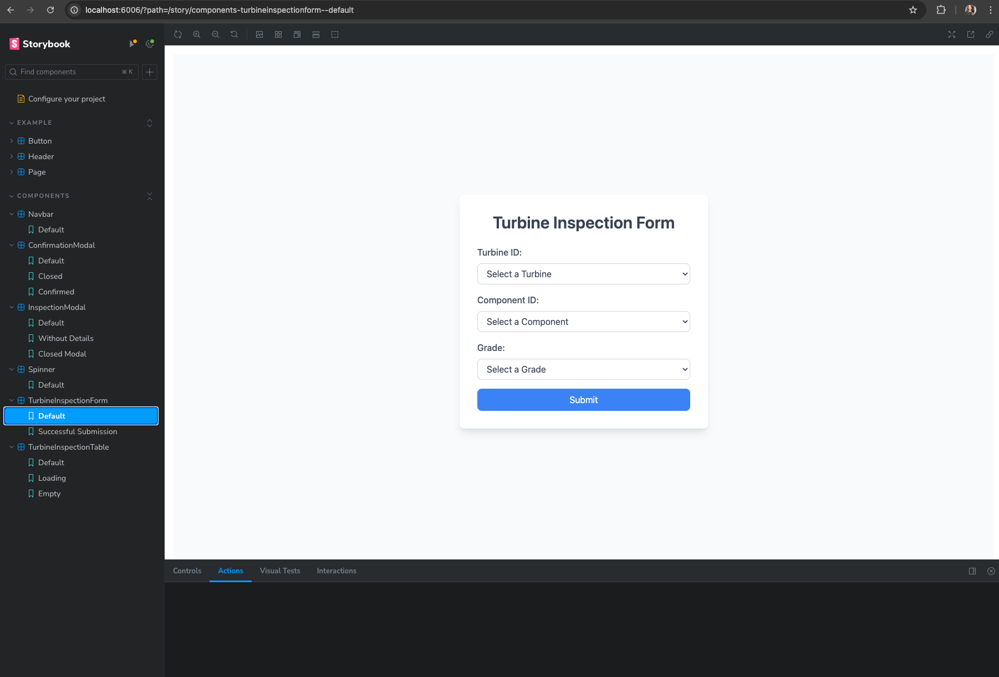

## About Software Development @ Cyberhawk

need some content for this section

## The task
We've designed this task to try and give you the ability to show us what you can do and hopefully flex your technical and creative muscles. You can't show off too much here, show us you at your best and wow us!

To make things as simple as we could, we've opted to use [Laravel Sail](https://laravel.com/docs/8.x/sail) to provide a quick and convenient development environment, this will require you to install
[Docker Desktop](https://www.docker.com/products/docker-desktop) before you can start the test. We've provided [some more detailed instructions](#setting-everything-up) below in case this is your first time using Docker or Sail.

We'd like you to build an application that will display an example wind farm, its turbines and their components.
We'd like to be able to see components and their grades (measurement of damage/wear) ranging between 1 - 5.

For example, a turbine could contain the following components:
- Blade
- Rotor
- Hub
- Generator

Don't worry about using real names for components or accurate looking data, we're more interested in how you structure the application and how you present the data.

Don't be afraid of submitting incomplete code or code that isn't quite doing what you would like, just like your maths teacher, we like to see your working.
Just Document what you had hoped to achieve and your thoughts behind any unfinished code, so that we know what your plan was.

### Requirements
- Display a list of turbine inspections
- Each Turbine should have a number of components
- A component can be given a grade from 1 to 5 (1 being perfect and 5 being completely broken/missing)
- Use Laravel Models to represent the Entities in the task.

### Bonus Points
- Great UX/UI
- Use of React JS
- Use of Tailwind CSS
- Use of 3D
- Use of a web map technology in the display of the data
- Automated tests
- API Authentication
- Use of coding style guidelines (we use PSR-12 and AirBnb)
- Use of git with clear logical commits
- Specs/Plans/Designs

### Submitting The Task
We're not too fussy about how you submit the task, providing it gets to us and we're able to run it we'll be happy however here are some of the ways we commonly see:
- Fork this repo, work and add us as a collaborator on your GitHub repo and send us a link
- ZIP the project and email it to us at nick.stewart@thecyberhawk.com

## Setting Everything Up
As mentioned above we have chosen to make use of Laravel Sail as the foundation of this technical test.
- If you haven't already, you will need to install [Docker Desktop](https://www.docker.com/products/docker-desktop).
- One that is installed your next step is to install this projects composer dependencies (including Sail).
    - This will require either PHP 8 installed on your local machine or the use of [a small docker container](https://laravel.com/docs/8.x/sail#installing-composer-dependencies-for-existing-projects) that runs PHP 8 that can install the dependencies for us.
- If you haven't done so already copy the `.env.example` file to `.env`
    - If you are running a local development environment you may need to change some default ports in the `.env` file
        - We've already changed mysql to 33060 and NGINX to 81 for you
- It should now be time to [start Sail](https://laravel.com/docs/8.x/sail#starting-and-stopping-sail) and the task

### Installing Composer Dependencies
https://laravel.com/docs/9.x/sail#installing-composer-dependencies-for-existing-projects
```bash
docker run --rm \
-u "$(id -u):$(id -g)" \
-v $(pwd):/var/www/html \
-w /var/www/html \
laravelsail/php81-composer:latest \
composer install --ignore-platform-reqs
```

## Your Notes
This is a place for you to add your notes, plans, thinking and any feedback you have for us of the task, please feel free to include whatever you like here, we'll make sure to read it. 

### Aditional Setup
```bash
Sail
$ ./vendor/bin/sail up

DB Tables
$ ./vendor/bin/sail php artisan migrate

DB Seeds
$ ./vendor/bin/sail php artisan db:seed --class=TurbineSeeder  

URL
http://0.0.0.0/

Client
$ ./vendor/bin/sail npm run watch

Storybook
$ ./vendor/bin/sail npm run storybook

Unit tests
$ ./vendor/bin/sail test
```

## Project Overview
This application is built with three main entity models: Turbine, Component, and TurbineInspection. A Turbine can have multiple Components, and each Component can have multiple Inspections.

### Technologies Used
<b>Backend</b>: Laravel
<b>Frontend</b>: React.js
<b>Styling</b>: Tailwind CSS
<b>FE testing</b>: Storybook
<b>BE testing</b>: PHP Unit

The application is responsive, ensuring a seamless experience across desktop, tablet, and mobile devices.

### Features
### Turbine Inspection List View

- Displays a table of turbine inspections.
- Includes a search bar for filtering inspections by Turbine or Component Name.
- Supports backend pagination for navigating through the list.
- Enables sorting by creation date.

### Turbine Inspection Form View

- A dedicated form for creating turbine inspections.

### Modals
<b>Inspection Details Modal</b>: View details of each inspection.

<b>Confirmation Modal</b>: Confirm deletion of an inspection.


### Storybook


## Note
I had tons of fun planing, designing, building and testing this project!